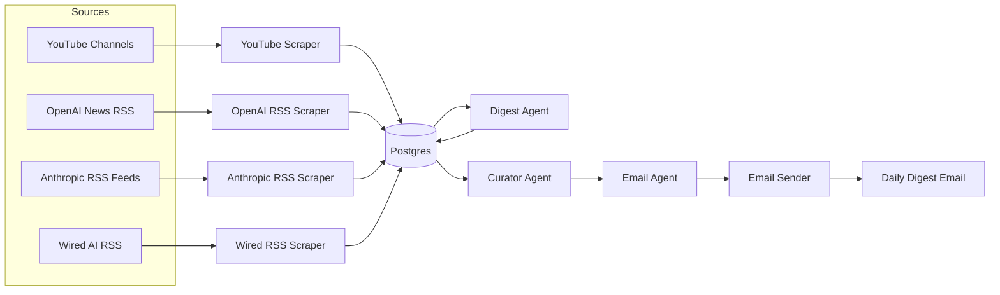
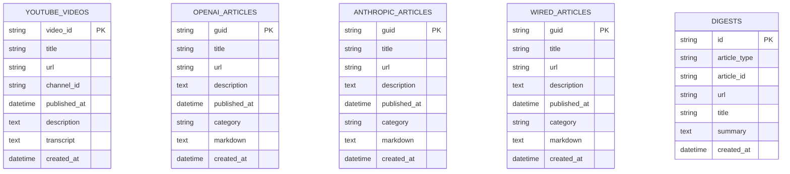

# My AI News Aggregator

## What This Project Is About
This project collects AI-related news from multiple sources, summarizes it using Gemini, stores results in Postgres, and sends a daily email digest.

## Purpose
The goal is to receive an automated daily AI news email without manual browsing.

## Architecture


### Architecture and Tech Stack Decisions
- **Batch pipeline**: The workflow runs once per day using a single entrypoint, which fits the “daily digest” use case.
- **Python**: Fast iteration for scraping, summarization, and email automation.
- **PostgreSQL + SQLAlchemy**: Reliable relational storage and simple queries for recent digests.
- **Gemini (google-genai)**: Generates summaries, ranks content, and writes the email intro.
- **GitHub Actions**: Low-cost scheduling with a built-in cron scheduler.

## Data Sources and Scraping
- **YouTube**: Uses the YouTube Data API to list recent videos per channel and fetches transcripts via `youtube-transcript-api`. Requires `GOOGLE_API_KEY`.
- **OpenAI News**: RSS feed (`https://openai.com/news/rss.xml`) parsed by `feedparser`.
- **Anthropic**: Multiple RSS feeds (news, research, engineering) parsed by `feedparser`.
- **Wired AI**: RSS feed (`https://www.wired.com/feed/tag/ai/latest/rss`) parsed by `feedparser`.
- **Article content conversion**: `docling` converts article URLs to markdown when needed.

## Database Schema


## Setup Instructions
### Prerequisites
- Python 3.11+
- Postgres (local via Docker or hosted)

### Install Dependencies
```bash
python -m venv .venv
source .venv/bin/activate
python -m pip install --upgrade pip
pip install .
```

### Environment Variables
Create a `.env` file based on `example.env` and set:
- `GEMINI_API_KEY`
- `GOOGLE_API_KEY`
- `MY_EMAIL`
- `APP_PASSWORD`
- `POSTGRES_URL`

Optional:
- `PROXY_USERNAME`
- `PROXY_PASSWORD`
  - Used for residential proxies because YouTube can rate-limit or block IPs when `youtube-transcript-api` makes many requests.
  - You can buy residential proxies from https://www.webshare.io/pricing

### Run Locally
```bash
python main.py 24 10
```

## Postgres Setup Options
### Local (Docker)
Use the Docker compose file:
- [docker-compose.yml](file:///Users/mehdi/Development/learning/my-ai-news-aggregator/docker/docker-compose.yml)

Example:
```bash
docker compose -f docker/docker-compose.yml up -d
```

Then set in `.env`:
- `POSTGRES_USER`
- `POSTGRES_PASSWORD`
- `POSTGRES_DB`
- `POSTGRES_HOST`
- `POSTGRES_PORT`

### Hosted (Neon)
This project uses Neon in production. Set:
- `POSTGRES_URL` to your Neon connection string.

## Deployment With GitHub Actions
The workflow runs daily on a schedule and can be triggered manually.
- Workflow file: [.github/workflows/send_digest.yml](file:///Users/mehdi/Development/learning/my-ai-news-aggregator/.github/workflows/send_digest.yml)

### How It Works
1. GitHub Actions checks out the repo.
2. It installs dependencies.
3. It runs `python main.py 24 10`.
4. The pipeline scrapes, summarizes, ranks, and emails the digest.

### Required Secrets (GitHub)
Set these in GitHub repo settings:
- `GEMINI_API_KEY`
- `GOOGLE_API_KEY`
- `POSTGRES_URL`
- `MY_EMAIL`
- `APP_PASSWORD`
- `PROXY_USERNAME` (optional)
- `PROXY_PASSWORD` (optional)

### Example Output


